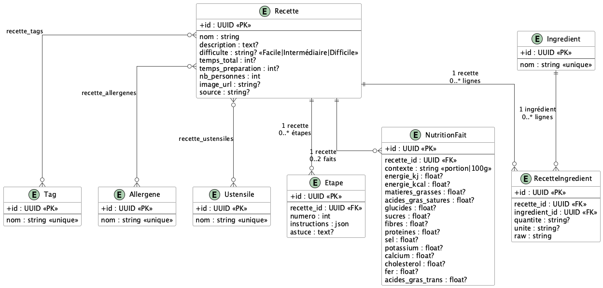
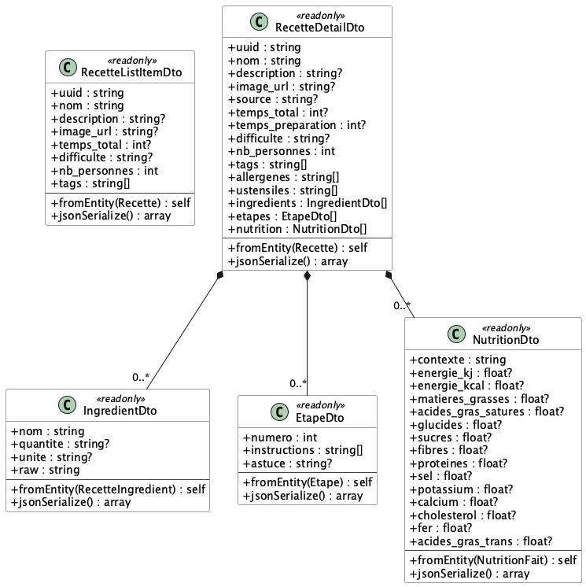

# Architecture — Kubo API

API REST JSON construite avec **Symfony 8**, **Doctrine ORM** et **PostgreSQL**.  
Elle expose 2 151 recettes HelloFresh importées depuis des fichiers JSON.

---

## Diagramme des entités



> Source PlantUML : [`uml/entities.puml`](uml/entities.puml)

---

## Entités

| Entité | Table SQL | Rôle |
|---|---|---|
| `Recette` | `recettes` | Entité centrale. Agrège toutes les informations d'une recette. |
| `Tag` | `tags` | Label libre associé à une recette (ex : *Végétarien*, *Rapide*). Dédupliqué par `nom`. |
| `Allergene` | `allergenes` | Allergène déclaré sur une recette (ex : *Gluten*, *Lait*). Dédupliqué par `nom`. |
| `Ustensile` | `ustensiles` | Matériel de cuisine requis (ex : *Poêle*, *Four*). Dédupliqué par `nom`. |
| `Ingredient` | `ingredients` | Ingrédient de base, dédupliqué par `nom`. Partagé entre recettes. |
| `RecetteIngredient` | `recette_ingredients` | Table de jointure enrichie entre `Recette` et `Ingredient`. Stocke la quantité, l'unité et la chaîne brute originale. |
| `Etape` | `etapes` | Étape de préparation ordonnée par `numero`. Les instructions sont stockées en JSON (tableau de phrases). |
| `NutritionFait` | `nutrition_faits` | Valeurs nutritionnelles pour un contexte donné (`portion` ou `100g`). Une recette peut avoir 0, 1 ou 2 entrées (une par contexte). |

---

## Relations

### ManyToMany

| Relation | Table pivot | Cascade | Notes |
|---|---|---|---|
| `Recette` ↔ `Tag` | `recette_tags` | `ON DELETE CASCADE` | Un tag peut appartenir à plusieurs recettes. |
| `Recette` ↔ `Allergene` | `recette_allergenes` | `ON DELETE CASCADE` | Un allergène peut appartenir à plusieurs recettes. |
| `Recette` ↔ `Ustensile` | `recette_ustensiles` | `ON DELETE CASCADE` | Un ustensile peut appartenir à plusieurs recettes. |

### OneToMany (owned by `Recette`)

| Relation | Cascade | Notes |
|---|---|---|
| `Recette` → `RecetteIngredient` | `CASCADE persist + remove`, `ON DELETE CASCADE` | Supprimés avec la recette. `orphanRemoval = true`. |
| `Recette` → `Etape` | `CASCADE persist + remove`, `ON DELETE CASCADE` | Triées par `numero ASC`. `orphanRemoval = true`. |
| `Recette` → `NutritionFait` | `CASCADE persist + remove`, `ON DELETE CASCADE` | Contrainte unique `(recette_id, contexte)`. |

### ManyToOne

| Relation | Nullable | Notes |
|---|---|---|
| `RecetteIngredient` → `Ingredient` | Non | L'ingrédient est partagé entre recettes, non supprimé en cascade. |

---

## DTOs

Les DTOs sont des classes `readonly` qui implémentent `\JsonSerializable`. Ils sont construits depuis les entités via des méthodes statiques `fromEntity()` et sérialisés directement par `JsonResponse`.



> Source PlantUML : [`uml/dtos.puml`](uml/dtos.puml)

---

## Endpoints

### `GET /api/recettes`

Liste paginée des recettes avec filtres optionnels.

**Paramètres query :**

| Paramètre | Type | Défaut | Description |
|---|---|---|---|
| `page` | `int` | `1` | Numéro de page (commence à 1) |
| `limit` | `int` | `20` | Éléments par page (max 100) |
| `q` | `string` | — | Recherche texte `ILIKE` sur `nom` et `description` |
| `tag` | `string` | — | Filtre sur le nom exact d'un tag |
| `difficulte` | `string` | — | `Facile`, `Intermédiaire` ou `Difficile` |
| `temps_max` | `int` | — | `temps_total <=` N minutes |
| `ingredient` | `string` | — | Recherche texte `ILIKE` sur le nom d'un ingrédient |

**Réponse `200` :**

```json
{
  "data": [
    {
      "uuid": "018e1b2c-3d4e-7f8a-9b0c-1d2e3f4a5b6c",
      "nom": "Poulet rôti aux herbes",
      "description": "Un poulet rôti savoureux...",
      "image_url": "https://...",
      "temps_total": 35,
      "difficulte": "Facile",
      "nb_personnes": 2,
      "tags": ["Viande", "Rapide"]
    }
  ],
  "meta": {
    "total": 2151,
    "page": 1,
    "limit": 20,
    "pages": 108
  }
}
```

---

### `GET /api/recettes/{uuid}`

Détail complet d'une recette par son UUID.

**Paramètre path :**

| Paramètre | Type | Description |
|---|---|---|
| `uuid` | `string (uuid)` | UUID de la recette |

**Réponse `200` :**

```json
{
  "uuid": "018e1b2c-3d4e-7f8a-9b0c-1d2e3f4a5b6c",
  "nom": "Poulet rôti aux herbes",
  "description": "Un poulet rôti savoureux...",
  "image_url": "https://...",
  "source": "https://hellofresh.fr/recettes/...",
  "temps_total": 35,
  "temps_preparation": 10,
  "difficulte": "Facile",
  "nb_personnes": 2,
  "tags": ["Viande", "Rapide"],
  "allergenes": ["Gluten"],
  "ustensiles": ["Four"],
  "ingredients": [
    { "nom": "poulet", "quantite": "300", "unite": "g", "raw": "300 g de poulet" }
  ],
  "etapes": [
    { "numero": 1, "instructions": ["Préchauffer le four à 200°C.", "Badigeonner d'huile."], "astuce": "Utiliser de l'huile d'olive." }
  ],
  "nutrition": [
    { "contexte": "portion", "energie_kcal": 320.0, "proteines": 28.0, "glucides": 5.0, "matieres_grasses": 18.0, "..." : "..." }
  ]
}
```

**Réponse `404` :**

```json
{ "error": "Recette non trouvée." }
```
